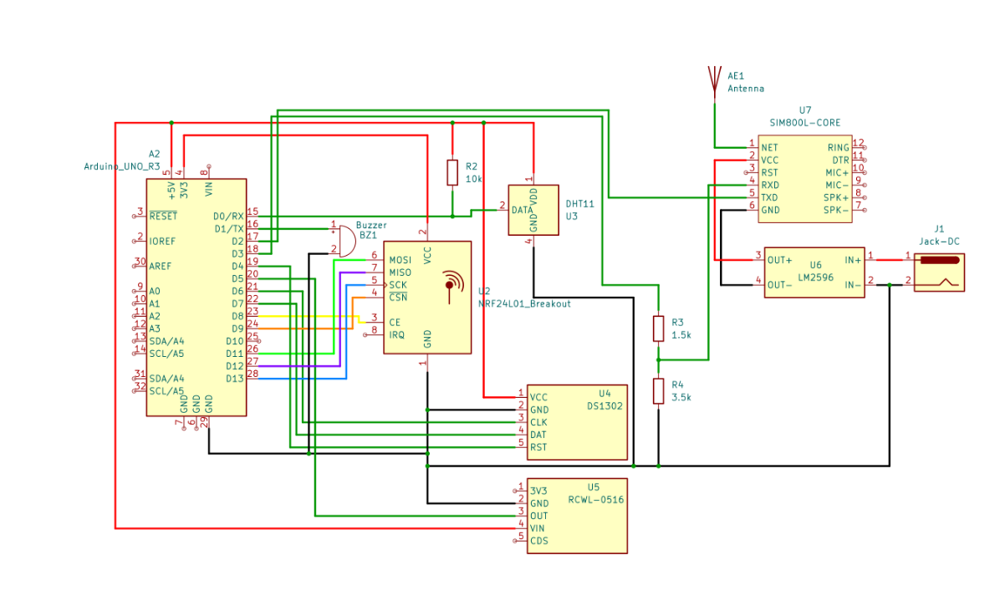

# Motion Sensor with GSM and Radio Communication
- [English Version](#english)
- [Polska Wersja](#polski)

---

## English

A distributed environmental monitoring and motion detection system based on Arduino microcontrollers. The system consists of two wireless communicating nodes that collect sensor data, detect motion, and notify users via SMS.

---

### System Overview

The project implements a wireless sensor network with the following key features:
- Environmental monitoring (temperature and humidity)
- Microwave motion detection (RCWL-0516)
- GSM communication for SMS alerts and remote control
- 2.4 GHz radio communication between nodes
- Real-time clock for event timestamping
- Visual and audio signaling



---

### System Architecture

The system consists of two main modules:

**Transmitter Module:**
- Collects environmental data (DHT11 sensor)
- Detects motion using RCWL-0516 microwave sensor
- Sends SMS notifications via SIM800L GSM module
- Transmits motion data to receiver via nRF24L01
- Responds to SMS commands from user
- Audio feedback via buzzer

**Receiver Module:**
- Receives motion detection data via nRF24L01
- Visual indication using LED
- Simple, dedicated endpoint for event signaling

---

### Features
- **Remote Monitoring**: Query temperature and humidity via SMS commands
- **Motion Detection**: 360° microwave sensor with 5-7m range
- **SMS Alerts**: Automatic notifications when motion is detected (rate-limited to 1/minute)
- **Remote Control**: Trigger buzzer via SMS for system confirmation
- **Wireless Communication**: 2.4 GHz radio link between transmitter and receiver
- **Time Management**: RTC module for accurate event timestamping

---

### Hardware Components

**Transmitter:**
- Arduino UNO
- SIM800L GSM module
- DHT11 temperature/humidity sensor
- RCWL-0516 microwave motion sensor
- nRF24L01 radio module
- DS1302 RTC module
- LM2596 step-down converter (for SIM800L power regulation)
- Buzzer

**Receiver:**
- Arduino UNO
- nRF24L01 radio module
- LED indicator

---

### Project Structure
```
motion-gsm-radio-sensor/
├── transmitter/
│   └── transmitter.ino          # Transmitter node code
├── receiver/
│   └── receiver.ino             # Receiver node code
├── docs/
│   ├── transmitter_scheme.png   # Transmitter wiring diagram
│   ├── receiver_scheme.png      # Receiver wiring diagram
│   └── system_photo.jpg         # Physical setup photo
└── README.md
```

---

### Pin Configuration

**Transmitter:**
- DHT11: Digital pin 0
- Buzzer: Digital pin 1
- SIM800L TX: Digital pin 2
- SIM800L RX: Digital pin 3
- DS1302 RST: Digital pin 4
- RCWL-0516: Digital pin 5
- DS1302 CLK: Digital pin 6
- DS1302 DAT: Digital pin 7
- nRF24L01 CE: Digital pin 8
- nRF24L01 CSN: Digital pin 9

**Receiver:**
- LED: Digital pin 3
- nRF24L01 CE: Digital pin 8
- nRF24L01 CSN: Digital pin 9

---

### Required Libraries
- SoftwareSerial (built-in)
- DHT11
- ThreeWire
- RtcDS1302
- RF24
- RF24Network
- SPI (built-in)

Install via Arduino Library Manager or manually download from GitHub.

---

### Installation

1. **Hardware Setup:**
   - Connect components according to pin configuration
   - Use LM2596 converter to provide stable 4.0V for SIM800L
   - Use proper adapters for nRF24L01 modules to ensure stable power supply

2. **Software Setup:**
   ```bash
   # Clone repository
   git clone https://github.com/yourusername/motion-gsm-radio-sensor.git
   
   # Install required libraries via Arduino IDE Library Manager
   ```

3. **Configuration:**
   - Update `PHONE_NUMBER` in transmitter code with your phone number
   - Upload transmitter.ino to transmitter Arduino
   - Upload receiver.ino to receiver Arduino

---

### Usage

**SMS Commands:**
- `getTemp` - Request current temperature reading
- `getHumid` - Request current humidity reading
- `getBuzz` - Trigger buzzer for 1 second (system confirmation)

**Automatic Operation:**
- Motion detection automatically sends SMS alert (max 1 per minute)
- Receiver LED lights up when motion is detected
- System continuously monitors environment

**Example SMS Commands:**
```
Send: "getTemp"
Receive: "Temperatura: 23C"

Send: "getHumid"
Receive: "Wilgotnosc: 45%"

Send: "getBuzz"
Receive: [Buzzer sounds for 1 second]

Motion detected:
Receive: "Wykryto ruch!"
```

---

### Technical Specifications

**DHT11 Sensor:**
- Temperature range: 0-50°C (±2°C accuracy)
- Humidity range: 20-90% RH (±5% accuracy)

**RCWL-0516 Motion Sensor:**
- Detection range: 5-7 meters
- Detection angle: 360°
- Technology: Microwave Doppler radar

**nRF24L01 Radio:**
- Frequency: 2.4 GHz
- Data rate: 2 Mbps
- Network channel: 90

**Power Requirements:**
- Arduino UNO: 5V (USB or external)
- SIM800L: 4.0V (via LM2596 converter)
- Other modules: 3.3-5V compatible

---

### Troubleshooting

**SIM800L Issues:**
- Ensure stable 4.0V power supply using LM2596 converter
- Check antenna connection
- Verify SIM card has active cellular service
- Allow 10-15 seconds for module initialization

**nRF24L01 Communication Problems:**
- Use dedicated power adapter modules for stable voltage
- Check CE and CSN pin connections
- Verify both modules use same channel (90) and data rate
- Keep antennas away from metal objects

**Motion Detection:**
- RCWL-0516 may be sensitive to electrical noise
- Allow warm-up time after power-on
- Adjust positioning for optimal coverage

**SMS Rate Limiting:**
- System sends max 1 SMS per minute for motion detection
- This prevents excessive SMS charges
- Manual commands (getTemp, getHumid, getBuzz) work without delay

---

### Future Improvements
- Battery power support with sleep modes
- Multiple sensor nodes in mesh network
- Web dashboard for data visualization
- SD card logging for historical data
- Adjustable sensitivity settings via SMS

---

### License
MIT License - See LICENSE file for details

---

### Authors
- Piotr Kowalski
- Denis Piętak

Project created as part of Sensor Networks course, Telecommunications S1, Semester 7.

---

## Polski

Rozproszony system monitorowania warunków środowiskowych i detekcji ruchu oparty na mikrokontrolerach Arduino. System składa się z dwóch węzłów komunikujących się bezprzewodowo, które zbierają dane z czujników, wykrywają ruch i powiadamiają użytkowników przez SMS.

---

### Przegląd Systemu

Projekt realizuje bezprzewodową sieć czujników z następującymi funkcjami:
- Monitorowanie środowiska (temperatura i wilgotność)
- Mikrofalowa detekcja ruchu (RCWL-0516)
- Komunikacja GSM dla alertów SMS i zdalnego sterowania
- Komunikacja radiowa 2.4 GHz między węzłami
- Zegar czasu rzeczywistego do rejestracji zdarzeń
- Sygnalizacja wizualna i dźwiękowa


---

### Architektura Systemu

System składa się z dwóch głównych modułów:

**Moduł Nadajnika:**
- Zbiera dane środowiskowe (czujnik DHT11)
- Wykrywa ruch za pomocą mikrofalowego czujnika RCWL-0516
- Wysyła powiadomienia SMS przez moduł GSM SIM800L
- Transmituje dane o ruchu do odbiornika przez nRF24L01
- Odpowiada na komendy SMS od użytkownika
- Sygnalizacja dźwiękowa przez buzzer

**Moduł Odbiornika:**
- Odbiera dane o wykrytym ruchu przez nRF24L01
- Sygnalizacja wizualna za pomocą diody LED
- Prosty, dedykowany punkt końcowy do sygnalizacji zdarzeń

---

### Funkcje
- **Zdalne Monitorowanie**: Odpytywanie temperatury i wilgotności przez SMS
- **Detekcja Ruchu**: Czujnik mikrofalowy 360° z zasięgiem 5-7m
- **Alerty SMS**: Automatyczne powiadomienia przy wykryciu ruchu (limit 1/minutę)
- **Zdalne Sterowanie**: Uruchomienie buzzera przez SMS (potwierdzenie działania)
- **Komunikacja Bezprzewodowa**: Łącze radiowe 2.4 GHz między nadajnikiem a odbiornikiem
- **Zarządzanie Czasem**: Moduł RTC do dokładnego znacznika czasu zdarzeń

---

### Komponenty Sprzętowe

**Nadajnik:**
- Arduino UNO
- Moduł GSM SIM800L
- Czujnik temperatury/wilgotności DHT11
- Mikrofalowy czujnik ruchu RCWL-0516
- Moduł radiowy nRF24L01
- Moduł RTC DS1302
- Przetwornica step-down LM2596 (stabilizacja napięcia dla SIM800L)
- Buzzer

**Odbiornik:**
- Arduino UNO
- Moduł radiowy nRF24L01
- Dioda LED sygnalizacyjna

---

### Struktura Projektu
```
motion-gsm-radio-sensor/
├── transmitter/
│   └── transmitter.ino          # Kod węzła nadajnika
├── receiver/
│   └── receiver.ino             # Kod węzła odbiornika
├── docs/
│   ├── transmitter_scheme.png   # Schemat połączeń nadajnika
│   ├── receiver_scheme.png      # Schemat połączeń odbiornika
│   └── system_photo.jpg         # Zdjęcie fizycznego układu
└── README.md
```

---

### Konfiguracja Pinów

**Nadajnik:**
- DHT11: Pin cyfrowy 0
- Buzzer: Pin cyfrowy 1
- SIM800L TX: Pin cyfrowy 2
- SIM800L RX: Pin cyfrowy 3
- DS1302 RST: Pin cyfrowy 4
- RCWL-0516: Pin cyfrowy 5
- DS1302 CLK: Pin cyfrowy 6
- DS1302 DAT: Pin cyfrowy 7
- nRF24L01 CE: Pin cyfrowy 8
- nRF24L01 CSN: Pin cyfrowy 9

**Odbiornik:**
- LED: Pin cyfrowy 3
- nRF24L01 CE: Pin cyfrowy 8
- nRF24L01 CSN: Pin cyfrowy 9

---

### Wymagane Biblioteki
- SoftwareSerial (wbudowana)
- DHT11
- ThreeWire
- RtcDS1302
- RF24
- RF24Network
- SPI (wbudowana)

Instalacja przez Arduino Library Manager lub ręcznie z GitHub.

---

### Instalacja

1. **Konfiguracja Sprzętowa:**
   - Podłącz komponenty zgodnie z konfiguracją pinów
   - Użyj przetwornicy LM2596 do zapewnienia stabilnych 4.0V dla SIM800L
   - Użyj odpowiednich adapterów dla modułów nRF24L01 do stabilnego zasilania

2. **Konfiguracja Oprogramowania:**
   ```bash
   # Klonowanie repozytorium
   git clone https://github.com/twojeusername/motion-gsm-radio-sensor.git
   
   # Instalacja wymaganych bibliotek przez Arduino IDE Library Manager
   ```

3. **Konfiguracja:**
   - Zaktualizuj `PHONE_NUMBER` w kodzie nadajnika swoim numerem telefonu
   - Wgraj transmitter.ino do Arduino nadajnika
   - Wgraj receiver.ino do Arduino odbiornika

---

### Użycie

**Komendy SMS:**
- `getTemp` - Zapytanie o aktualną temperaturę
- `getHumid` - Zapytanie o aktualną wilgotność
- `getBuzz` - Uruchomienie buzzera na 1 sekundę (potwierdzenie działania)

**Automatyczne Działanie:**
- Detekcja ruchu automatycznie wysyła alert SMS (max 1 na minutę)
- Dioda LED odbiornika zapala się przy wykryciu ruchu
- System ciągle monitoruje środowisko

**Przykładowe Komendy SMS:**
```
Wyślij: "getTemp"
Odpowiedź: "Temperatura: 23C"

Wyślij: "getHumid"
Odpowiedź: "Wilgotnosc: 45%"

Wyślij: "getBuzz"
Odpowiedź: [Buzzer brzmi przez 1 sekundę]

Wykryto ruch:
Odpowiedź: "Wykryto ruch!"
```

---

### Specyfikacja Techniczna

**Czujnik DHT11:**
- Zakres temperatury: 0-50°C (dokładność ±2°C)
- Zakres wilgotności: 20-90% RH (dokładność ±5%)

**Czujnik Ruchu RCWL-0516:**
- Zasięg detekcji: 5-7 metrów
- Kąt detekcji: 360°
- Technologia: Radar mikrofalowy Dopplera

**Radio nRF24L01:**
- Częstotliwość: 2.4 GHz
- Przepływność: 2 Mbps
- Kanał sieciowy: 90

**Wymagania Zasilania:**
- Arduino UNO: 5V (USB lub zewnętrzne)
- SIM800L: 4.0V (przez przetwornicę LM2596)
- Pozostałe moduły: kompatybilne z 3.3-5V

---

### Rozwiązywanie Problemów

**Problemy z SIM800L:**
- Upewnij się o stabilnym zasilaniu 4.0V przez przetwornicę LM2596
- Sprawdź połączenie anteny
- Zweryfikuj, czy karta SIM ma aktywną usługę komórkową
- Poczekaj 10-15 sekund na inicjalizację modułu

**Problemy Komunikacji nRF24L01:**
- Użyj dedykowanych modułów adapterowych do stabilnego napięcia
- Sprawdź połączenia pinów CE i CSN
- Zweryfikuj, czy oba moduły używają tego samego kanału (90) i przepływności
- Trzymaj anteny z dala od metalowych obiektów

**Detekcja Ruchu:**
- RCWL-0516 może być wrażliwy na zakłócenia elektryczne
- Odczekaj czas rozgrzewki po włączeniu zasilania
- Dostosuj pozycjonowanie dla optymalnego pokrycia

**Ograniczenie Częstości SMS:**
- System wysyła max 1 SMS na minutę dla detekcji ruchu
- Zapobiega to nadmiernym opłatom za SMS
- Komendy ręczne (getTemp, getHumid, getBuzz) działają bez opóźnienia

---

### Przyszłe Usprawnienia
- Wsparcie zasilania bateryjnego z trybami uśpienia
- Wiele węzłów czujnikowych w sieci mesh
- Panel webowy do wizualizacji danych
- Logowanie na karcie SD dla danych historycznych
- Regulowana czułość przez SMS

---

### Licencja
Licencja MIT - Zobacz plik LICENSE dla szczegółów

---

### Autorzy
- Piotr Kowalski
- Denis Piętak

Projekt stworzony w ramach przedmiotu Sieci Sensoryczne, Teleinformatyka S1, Semestr 7.
